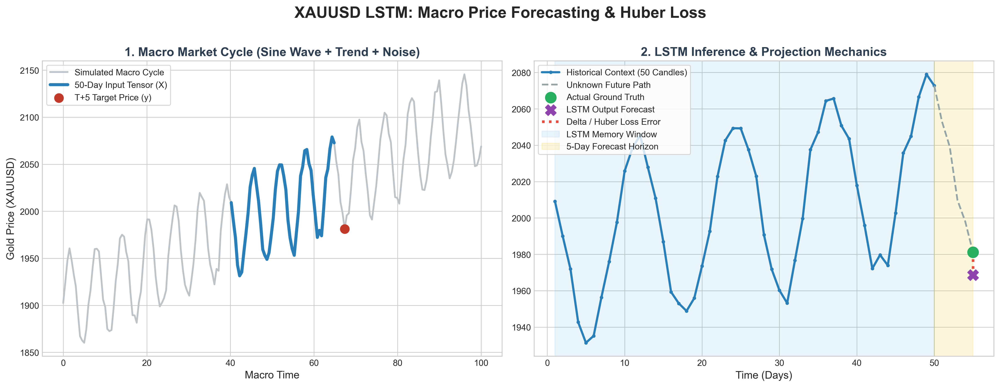

# XAUUSD Macro Price Forecaster

## Overview
This project is an LSTM-based regression model designed to predict exact future asset prices. It ingests a 3D Tensor of historical time-series data (50 sequential candles) and outputs a continuous price target for 5 days into the future. 

## Architecture
* **Inputs:** 3D Tensor `[Batch Size, Sequence Length (50), Features (1)]`.
* **Network:** Long Short-Term Memory (LSTM) network.
    * `nn.LSTM` (Hidden Size: 64, Layers: 2) to maintain a moving contextual memory.
    * `nn.Linear` output layer with **no activation function** to allow for continuous regression outputs.
* **Loss Function:** `HuberLoss`. A hybrid loss function that acts like Mean Squared Error (MSE) for normal price action, but transitions to Mean Absolute Error (MAE) during extreme news spikes to prevent gradient explosions.
* **Optimizer:** Stochastic Gradient Descent (SGD) with `momentum=0.9` to prevent the network from getting stuck in local loss minimums.

## Role in the Omni-Agent Ecosystem
This module functions as the target generator. Once a trade thesis is validated by the Volatility and Structure scanners, this LSTM provides the dynamic Take Profit (TP) and directional bias based on the macro trend memory.